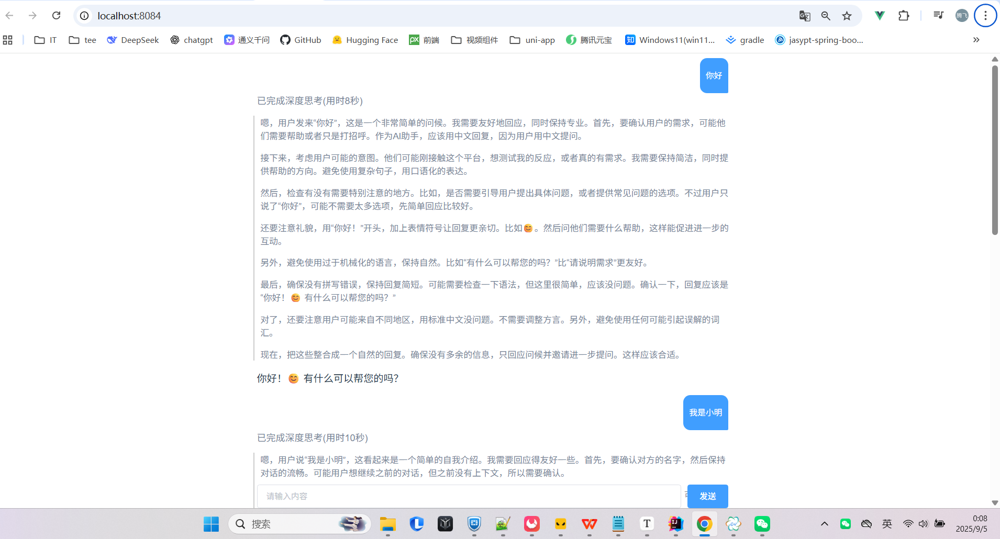

# WebClient + SSE 实现流式聊天系统

## 一、WebClient 简介

### 1. 为什么不用 RestTemplate？

	-  RestTemplate 是 **阻塞式** 的，一次请求必须等响应完整返回。

- 在处理流式数据、异步请求时，效率较低。
- Spring 官方已将 RestTemplate 标记为 **不推荐使用**。

### 2. WebClient 特点

- **响应式 & 非阻塞**：基于 Reactor，适合高并发场景。
- **支持流式响应**：可以直接消费服务端返回的 Flux 流。
- **链式调用**：API 风格更简洁，易于组合。

## 二、SSE（Server-Sent Events）的原理

- 基于 **HTTP 协议** 的单向通信机制。
- 浏览器通过 **EventSource** 发起请求，服务器保持连接不断开。
- 服务器以 `text/event-stream` 格式，持续向客户端推送数据。
- 数据以事件流的形式发送。
### 图片示例：

